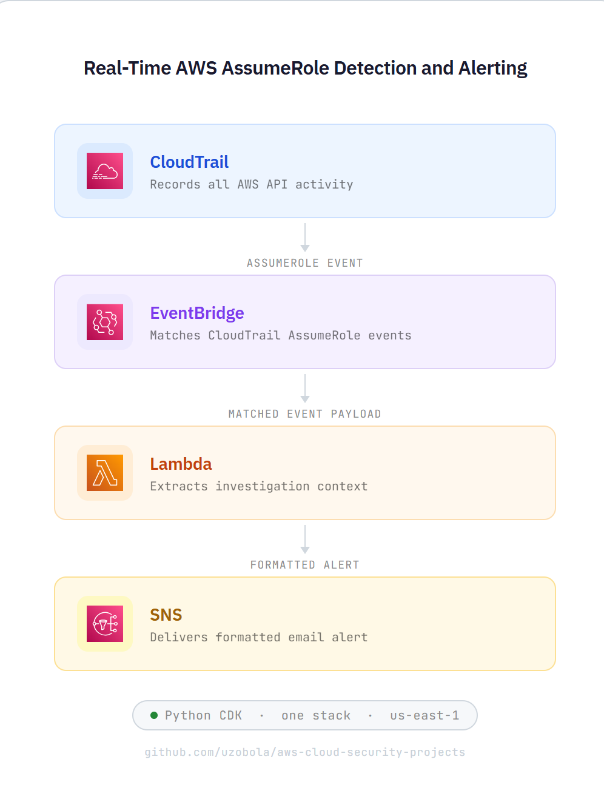

# AWS Cloud Security Projects

Hands-on AWS cloud security engineering projects focused on identity monitoring, detection engineering, and security automation with Python CDK.

---

## Featured Project: Real-Time AssumeRole Detection Pipeline

Detects AWS `AssumeRole` activity from CloudTrail in near real time, extracts investigation-relevant context, and delivers a formatted SNS email alert for rapid triage.

**Stack:** CloudTrail → EventBridge → Lambda → SNS  
**IaC:** AWS CDK (Python)

---

## Why AssumeRole matters

`AssumeRole` is a high-signal identity event that can appear in credential theft, lateral movement, privilege escalation, and cross-account access abuse scenarios. Near-real-time visibility improves investigation speed and reduces time-to-detect.

---

## What this demonstrates

- AWS-native detection engineering
- Identity-focused monitoring in AWS
- Event-driven security automation
- Serverless alerting with Lambda
- Infrastructure as code with Python CDK

---

## Architecture



Pipeline flow:

```text
CloudTrail (API events)
    → EventBridge (AssumeRole filter)
        → Lambda (parse + enrich)
            → SNS (email alert)
```

### EventBridge rule pattern
```json
{
  "source": ["aws.sts"],
  "detail-type": ["AWS API Call via CloudTrail"],
  "detail": {
    "eventSource": ["sts.amazonaws.com"],
    "eventName": ["AssumeRole"]
  }
}
```

---

## Alert fields

Each alert includes:

- Event time and name
- Account ID and region
- Source IP and user agent
- Principal type and ARN
- Principal account
- Target role ARN
- Role session name

---

## Example alert
```
Subject: [AWS Alert] AssumeRole detected in account 123456789012

AWS AssumeRole activity detected.

Time:               2025-03-27T18:42:11Z
Event Name:         AssumeRole
Account ID:         123456789012
Region:             us-east-1
Source IP:          203.0.113.10
User Agent:         aws-cli/2.15.0

Principal Type:     IAMUser
Principal ARN:      arn:aws:iam::123456789012:user/admin-user
Principal Account:  123456789012

Target Role ARN:    arn:aws:iam::123456789012:role/SecurityAuditRole
Role Session Name:  security-audit-session
```

---

## Evidence

Deployment and testing proof:

- `evidence/01-sns-subscription-confirmed.png` — SNS subscription confirmed
- `evidence/02-cdk-deploy-success.png` — CDK deploy: 15/15 resources CREATE_COMPLETE
- `evidence/03-lambda-test-success.png` — Lambda test: statusCode 200, messageId returned
- `evidence/04-alert-email.png` — Alert email delivered to inbox with full context
- `evidence/05-eventbridge-rule.png` — EventBridge rule enabled and pattern confirmed
- `evidence/06-cloudtrail-trail.png` — CloudTrail trail active and logging

---

## Deploy
```bash
python3 -m venv .venv
source .venv/bin/activate
pip install -r requirements.txt
cdk bootstrap
cdk deploy -c alert_email=you@example.com
```

This deploys the CloudTrail trail, EventBridge rule, Lambda function, SNS topic, and email subscription.

After deploy, confirm the SNS subscription email before alerts will arrive.

---

## Planned v2 improvements

- Suspicious activity logic for cross-account, off-hours, and privileged role usage
- Severity scoring
- Allowlists for approved principals
- Dead-letter queue
- Unit tests for Lambda parsing logic
- Security Hub findings integration

---

## Repository structure
```
aws-cloud-security-projects/
├── README.md
├── assumerole_alerting/
│   └── assumerole_alerting_stack.py
├── lambda/
│   └── handler.py
├── examples/
│   └── sample-cloudtrail-assumerole-event.json
├── evidence/
│   ├── architecture-diagram.png
│   ├── 01-sns-subscription-confirmed.png
│   ├── 02-cdk-deploy-success.png
│   ├── 03-lambda-test-success.png
│   ├── 04-alert-email.png
│   └── 05-eventbridge-rule.png
├── app.py
└── requirements.txt
```